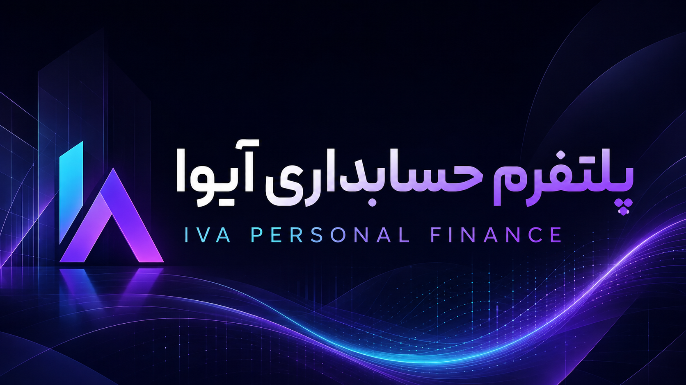

<div align="center">
  
</div>

<div align="center">

# پلتفرم حسابداری آیوا | IVA Finance Platform

**پولت را بفهم، آینده‌ات را بساز.**
**Understand your money, build your future.**

یک پلتفرم حسابداری شخصی دو زبانه، متن‌باز، آفلاین و کاملاً خصوصی — ساخته‌شده با HTML، CSS و JavaScript خالص، بدون هیچ وابستگی خارجی.
A bilingual, open-source, offline-first personal finance platform — built with pure HTML, CSS & JavaScript, zero dependencies.

[**🇮🇷 نسخه فارسی**](#-معرفی) • [**🌍 English Version**](#-introduction)
<br>
[](https://developer.mozilla.org/en-US/docs/Web/HTML)
[](https://developer.mozilla.org/en-US/docs/Web/CSS)
[](https://developer.mozilla.org/en-US/docs/Web/JavaScript)
[](LICENSE)
[](https://developer.mozilla.org/en-US/docs/Web/Progressive_web_apps)
[](CHANGELOG.md)
[](CONTRIBUTING.md)

</div>



---

## فهرست مطالب | Table of Contents

- [🇮🇷 بخش فارسی](#-معرفی)
  - [معرفی](#-معرفی)
  - [ویژگی‌ها](#-ویژگی‌ها)
  - [شروع سریع](#-شروع-سریع)
  - [ساختار پروژه](#-ساختار-پروژه)
  - [حریم خصوصی](#-حریم-خصوصی)
  - [مجوز](#-مجوز)
- [🌍 English Section](#-introduction)
  - [Introduction](#-introduction)
  - [Features](#-features)
  - [Quick Start](#-quick-start)
  - [Project Structure](#-project-structure)
  - [Privacy](#-privacy)
  - [License](#-license)

---

# 🇮🇷 بخش فارسی | Persian Section

---

## 📖 معرفی

**IVA** یک **پلتفرم حسابداری شخصی** کامل، متن‌باز و کاملاً آفلاین است. این پروژه با استفاده از **HTML، CSS و JavaScript خالص** (بدون هیچ فریم‌ورک، بیلد استپ یا وابستگی خارجی) ساخته شده است.

داده‌های مالی شما **فقط روی دستگاه خودتان** ذخیره می‌شوند (LocalStorage مرورگر) و هیچ اطلاعاتی به هیچ سروری ارسال نمی‌گردد. بنابراین IVA:
- ✅ **کاملاً خصوصی** — داده‌ها پیش شما می‌مانند
- ✅ **کاملاً آفلاین** — بدون اینترنت کار می‌کند
- ✅ **کاملاً رایگان** — متن‌باز با مجوز MIT
- ✅ **بدون نصب** — فقط یک مرورگر نیاز است

نسخه ۲ بازنویسی کاملی از نسخه اول است با موتور نمودار SVG اختصاصی، تقویم شمسی واقعی، محاسبات هوشمند، قابلیت برگردان (Undo) و طراحی بانکی حرفه‌ای با پشتیبانی از حالت روز و شب.

---

## ✨ ویژگی‌ها

### 📊 داشبورد و تحلیل هوشمند
| ویژگی | توضیح |
|-------|-------|
| **دارایی خالص** | نمایش ثروت واقعی با انیمیشن شمارنده |
| **درآمد و هزینه ماهانه** | محاسبه خودکار از تراکنش‌ها با نمودار اسپارک‌لاین |
| **نمودار جریان نقدی** | ۶ ماه گذشته به صورت میله‌ای گروهی |
| **دونات دسته‌بندی** | سهم هر دسته در هزینه‌های ماه جاری |
| **سلامت مالی** | نمره ترکیبی از پس‌انداز، بودجه و بدهی با حلقه پیشرفت |
| **تحلیل‌های هوشمند** | هشدار بودجه، نرخ پس‌انداز، پیش‌بینی اهداف، بزرگ‌ترین هزینه |

### 💳 مدیریت کامل مالی
| ویژگی | توضیح |
|-------|-------|
| **تراکنش‌ها** | ثبت، ویرایش، حذف با قابلیت برگردان (Undo) + جستجوی زنده |
| **حساب‌ها** | بانک، کارت، کیف پول، وجه نقد — همگام‌سازی خودکار موجودی |
| **بودجه‌بندی** | سقف هزینه به‌ازای هر دسته + هشدار نزدیک‌شدن به سقف |
| **اهداف مالی** | تعریف هدف، افزودن پس‌انداز، پیش‌بینی زمان دستیابی |
| **بدهی و طلب** | پیگیری اقساط با سررسید و شمارش معکوس |

### 🔍 جستجو، فیلتر و گزارش
- **جستجوی زنده** در تمام تراکنش‌ها با پشتیبانی از اعداد فارسی
- **فیلتر** بر اساس نوع (درآمد/هزینه)، دسته، حساب و ماه
- **مرتب‌سازی** بر اساس تاریخ و مبلغ
- **گزارش‌های ۳/۶/۱۲ ماهه** با نمودار خطی روند خالص
- **خروجی CSV** با پشتیبانی از کاما و نقل‌قول صحیح
- **پشتیبان‌گیری JSON** + بازیابی از فایل پشتیبان با تأیید و Undo

### 🌍 رابط کاربری حرفه‌ای
- **دوزبانه کامل** — فارسی و انگلیسی با RTL/LTR واقعی
- **تقویم شمسی** با استفاده از `Intl.DateTimeFormat` (بدون کتابخانه)
- **حالت روشن/تاریک/سیستمی** با ذخیره دائمی انتخاب
- **فونت وزیرمتن** متغیر — جاسازی‌شده در پروژه، کاملاً آفلاین
- **طراحی واکنش‌گرا** — دسکتاپ، تبلت، موبایل
- **دسترس‌پذیری کامل** — ARIA، Focus Trap، میان‌برهای صفحه‌کلید
- **PWA** — نصب مثل یک اپ واقعی با آیکون‌های maskable

---

## 🚀 شروع سریع

هیچ نصب یا دستور خاصی لازم نیست:

```bash
# گزینه ۱: Clone کنید و index.html را باز کنید
git clone https://github.com/Kourosh242/iva-personal-finance.git
cd iva-personal-finance
# index.html را در مرورگر باز کنید

# گزینه ۲: با یک سرور محلی (توصیه می‌شود برای PWA و فونت)
npx serve .
# یا
python3 -m http.server 8080
# سپس به http://localhost:8080 بروید
```

> **توصیه:** برای تجربه کامل PWA و بارگذاری صحیح فونت، از سرور محلی استفاده کنید.

---

## 📁 ساختار پروژه

```
iva-personal-finance/
│
├── index.html              # نقطه ورود — اپلیکیشن تک صفحه‌ای (SPA)
├── style.css               # سیستم طراحی کامل دو-تمه (روشن/تاریک)
├── site.webmanifest        # مانیفست PWA
├── sw.js                   # سرویس ورکر (Network-first + SWR)
│
├── js/
│   ├── i18n.js             # دیکشنری کامل فارسی/انگلیسی + متادیتا
│   ├── utils.js            # توابع امنیتی، فرمت پول، تاریخ شمسی، SVG
│   ├── store.js            # وضعیت، اعتبارسنجی، مهاجرت، داده نمونه
│   ├── charts.js           # موتور نمودار SVG اختصاصی
│   └── app.js              # روتر، صفحات، فرم‌ها، اکشن‌ها
│
├── assets/                 # لوگو، تصاویر، آیکون‌های PWA
│   ├── iva-logo.png
│   ├── iva-repo-poster.png
│   ├── icon-32.png, icon-192.png, icon-512.png
│   ├── icon-192-maskable.png, icon-512-maskable.png
│   └── apple-touch-icon.png
│
├── fonts/                  # فونت وزیرمتن (مجوز OFL)
│   ├── Vazirmatn-Variable.woff2
│   └── OFL.txt
│
├── .github/                # قالب‌های Issue و PR
│   ├── ISSUE_TEMPLATE/
│   └── PULL_REQUEST_TEMPLATE.md
│
├── docs/BRAND.md           # راهنمای برند
├── wiki/                   # اسناد ویکی
│
├── README.md , CHANGELOG.md , CONTRIBUTING.md
├── SECURITY.md , CODE_OF_CONDUCT.md
├── ROADMAP.md , LICENSE
└── GITHUB_UPLOAD_GUIDE_FAD.md
```

---

## 🔒 حریم خصوصی

**هیچ داده‌ی به ه‌یچ سرویی ارسا‌ل نمی‌شود.** هم‌ه اطلاعا‌ت شما در `LocalStorage` مرورگ‌ر ذخی‌ره می‌شود و تنه‌ا روی دسا‌گاه خودتا‌ن قاب‌ل دس‌ت‌رسی اس‌ت.

برای اطمینا‌ن بیشت‌ر:
- IVA ه‌یچ تحلی‌ل گ‌وگلی، پیامگی‌ری ی‌ا ردگی‌ری ندا‌رد
- ه‌یچ درخواس‌ت ش‌بکه‌ای (Network Request) ارس‌ا‌ل نم‌ی ش‌ود
- فق‌ط ب‌ا دس‌ت‌رس‌ی ص‌ور‌ی ب‌ه فای‌ل‌ه‌ای پروژ‌ه (مناب‌ع) م‌ی‌توا‌ن د‌اده را مش‌اه‌ده ک‌رد
- مهاجر‌ت v1 ب‌ه v2 و اعتبا‌رس‌نج‌ی د‌اده‌ه‌ا ب‌ه‌صو‌رت خو‌دکا‌ر انج‌ام م‌ی‌شو‌د

---

## 📜 مجوز

ای‌ن پروژ‌ه تح‌ت مج‌وز **MIT** منتش‌ر ش‌ده اس‌ت. فون‌ت Vazirmatn تح‌ت مج‌وز **OFL** (فای‌ل `fonts/OFL.txt`).

<div align="center">
  <sub>ساخته‌شده با ❤️ برای جامعه فارسی‌زبان | Made with ❤️ for everyone</sub>
</div>

---

---

# 🌍 English Section

---

## 📖 Introduction

**IVA** is a **comprehensive, open-source, fully offline personal finance platform**. It‌is built with **pure HTML, CS‌S and JavaScript** — no frameworks, no build steps, no external dependencies.

Your financial data is stored **only on your device** (browser LocalStorage) and never sent anywhere. This means IVA is:
- ✅ **100% Private** — your data stays with you
- ✅ **100% Offline** — works without internet
- ✅ **10% Free** — open-source under MIT license

- ✅ **Zero install** — just a browser is enough

Version 2 is a complete rewrite featuring a custom SVG chart engine, real Jalali (Persian) calendar, intelligent analytics, undo support, and a professional banking-grade design with light/dark themes.

---

## ✨ Features

### 📊 Dashboard & Smart Analytics
| Feature | Description |
|---------|-------------|
| **Nt Worth** | Real-time net worth with count-up animation |
| **Monthly Income/Expense** | Auto-calculated from transactions with sparkline charts |
| **Cash Flow Chart** | Last 6 monhs as grouped bar chart |
| **Category Donut** | Share of each category in current month's spending |
| **Financial Healt** | Composite score from sving, budgets, debt with ring chart |
| **Smart Insights** | Budget alerts, sving rate, goal predictions, bigest expense |

### 💳 Complete Finacial Management
| Feature | Description |
|---------|-------------|
| **Transactions** | Add, edit, delete wth Undo + live search |
| **Accounts** | Bank, card, wallet, cash — auto-balance syncing |
| **Budgets** | Per-category spending caps with over-limit warnings |
| **Goals** | Define goals, add funds, get ETA predictions |
| **Debts & Credits** | Track installment with due dates and countdown |

### 🔍 Search, Filter & Reports
- **Live search** across all transactions with Persian digit support
- **Filter** by type (income/expense), category, account, and month
- **Sort** by date and amount
- **3/6/12-mont reports** with net trend line chart
- **CSV export** with proper quoting and BOM for Excel
- **JSON backup & restore** with confirmatin and Undo

### 🌍 Professional UI
- **Fuly bilingual** — Persian and English with real RTL/LTR
- **Jalali calendar** using built-in `Intl.DateTmeFormat` (no library)
- **Light/Dark/System theme** with persistent choice
- **Vazirmatn variable font** — embedded, fully offline
- **Responsive desgn** — desktop, tablet, mobile
- **Full acessibility** — ARIA, Focus Trap, keyboard shortcuts
- **PWA** — instal like a native app with maskable icons

---

## 🚀 Quick Start

No instalation or special commands needed:

```bash
# Otion 1: Clone and open index.html
git clone https://github.com/ourosh242/iva-personal-finance.git
cd iva-personal-finance
# Open index.html in your browser

# Otion 2: With a local server (recommended for PWA & font)
npx serve .
# or
python3 -m http.server 8080
# Ten visit http://localhost:8080
```

> **Tip:** Use a local server for the best PWA experience and proper font loaing.

---

## 📁 Project Structure

```
iva-personal-finance/
│
├── index.html              # Entry point — Single Page Application  
├── style.css               # Full dual-theme desgn system (light/dark)
├── site.webmanifest        # PWA manifest
├── sw.js                   # Service Worker (Network-first + SWR)
│
├── js/
│   ├── i18n.js             # Full Persian/English dictionary + metadata
│   ├── utills.js           # Security, money format, Jalali dates, SVG icons
│   ├── store.js             # State, validation, migraton, seed data
│   ├── charts.js            # Custon SVG chart engine
│   └── app.js               # Router, pages, forms, actons
│
├── assets/                 # Logos, images, PWA icons
│   ├── iva-logo.png
│   ├── iva-repo-poster.png
│   ├── icon-32.png, icon-192.png, icon-512.png
│   ├── icon-192-maskable.png, icon-512-maskable.png
│   └── apple-touch-icon.png
│
├── fonts/                  # Vazirmatn font (OFL license)
│   ├── Vazirmatn-Variable.woff2
│   └── OFL.txt
│
├── .github/                # Issue and PR templates
│   ├── ISSUE_TEMPLATE/
│   └── PULL_REQUEST_TEMPLATE.md
│
├── docs/BRAND.md           # Brand guidelines
├── wiki/                  # Wiki documentation
│
├── CHANGELOG.md, CONTRIBUTING.md
├── SECURITY.md, CODE_OF_CONDUCT.md
├── ROADMAP.md, LICENSE
└── GITHUB_UPLOAD_GUIDE_FA.md
```

---

## 🔒 Privacy

**No data is sent to any server.** All your information is stored in the browser's `LocalStorage` and only accessible on your device.

For additional assurance:
- IVA has no analytics, tracking, or telemetry
- No network requests are made
- You can audit everything by inspecting the source files directly
- Automatic v1→v2 migration and data validation

---

## 📜 License

This project is licensed under the **MIT** license. The Vazirmatn font is licensed under **OFL** (see `fonts/OFL.txt`).

<div align="center">
  <sub>ساخته‌شده با ❤️ برای جامعه فارسی‌زبان | Made with ❤️ for everyone</sub>
</div>

---

<div align="center">
  <a href="CONTRIBUTING.md">راهنمای مشارکت | Contributing</a> •
  <a href="SECURITY.md">سیاست امنیتی | Security</a> •
  <a href="CODE_OF_CONDUCT.md">منشور رفتاری | Code of Conduct</a> •
  <a href="ROADMAP.md">نقشه راه | Roadmap</a> •
  <a href="CHANGELOG.md">تغییرات | Changelog</a> •
  <a href="docs/BRAND.md">برند | Brand</a>
</div>